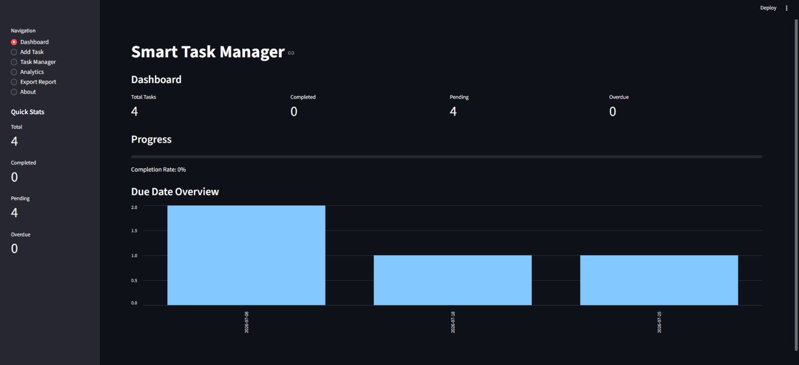
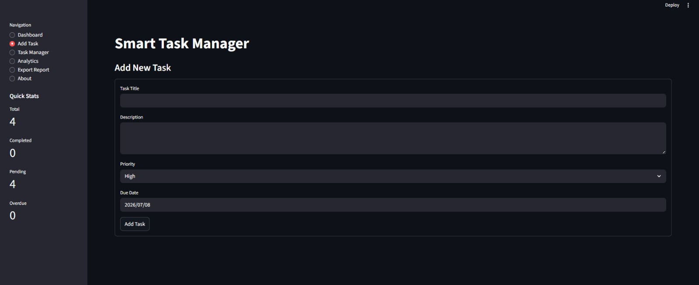
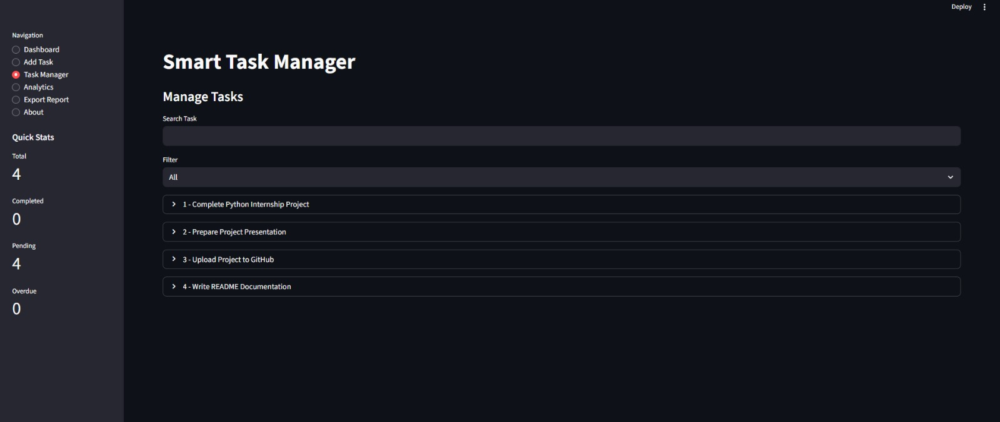
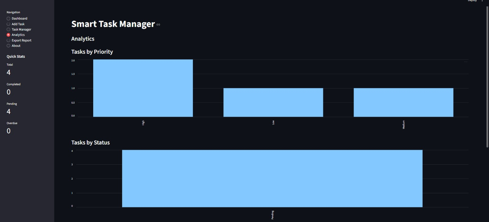
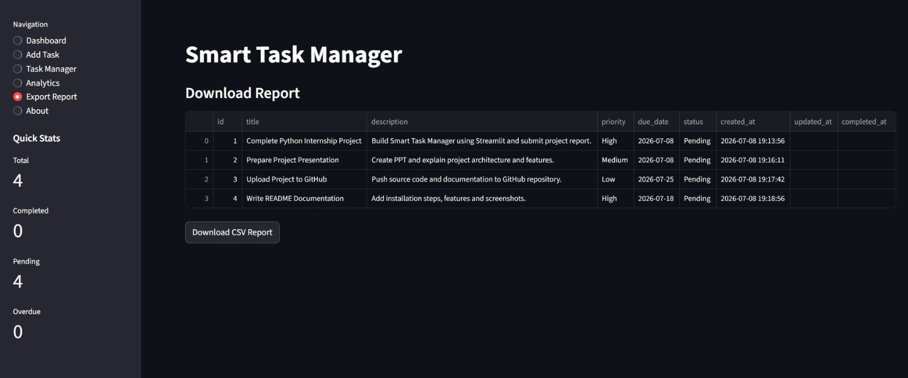
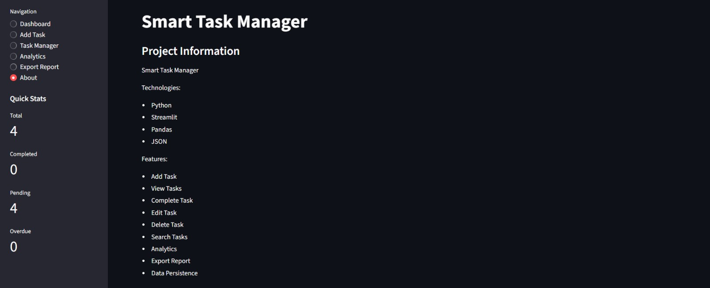

# Smart Task Manager


Smart Task Manager is a web-based task management application developed using **Python** and **Streamlit**. It helps users organize, track, and manage daily tasks through an interactive dashboard, analytics, and report generation.

This project was developed as part of the **Python Programming Internship at DecodeLabs** to demonstrate Python fundamentals, data structures, CRUD (Create, Read, Update, Delete) operations, JSON file handling, and interactive web application development.

---

## Project Overview

Smart Task Manager provides a simple and efficient way to manage daily tasks. Users can create, edit, search, filter, complete, and delete tasks while tracking their progress through dashboards and analytics. All task data is stored permanently using JSON files.

---

## Features

### Dashboard
- View total tasks
- View completed tasks
- View pending tasks
- View overdue tasks
- Track overall task completion progress
- View due date overview chart
- Quick task statistics in the sidebar

### Task Management
- Add new tasks
- Edit existing tasks
- Delete tasks
- Mark tasks as completed
- Search tasks by title
- Filter tasks by:
  - All Tasks
  - Pending Tasks
  - Completed Tasks
  - High Priority Tasks
  - Overdue Tasks
- Prevent duplicate task titles

### Analytics
- View tasks by priority
- View task completion status
- Compare overdue and on-time tasks using charts

### Export Report
- Display all tasks in a table
- Download task reports as CSV files

### About
- View project information
- View technologies used
- View application features

### Data Persistence
- Save tasks using JSON files
- Automatically load saved tasks when the application starts
- Store task creation, update, and completion timestamps

---

## Objectives

- Develop an interactive task management application using Python and Streamlit.
- Implement CRUD operations for task management.
- Store task information using JSON file handling.
- Display task statistics through dashboards and charts.
- Apply Python programming concepts in a real-world project.

---

## Technologies Used

- Python 3
- Streamlit
- Pandas
- JSON

---

## Python Concepts Demonstrated

- Lists
- Dictionaries
- Functions
- Loops
- Conditional Statements
- CRUD Operations
- File Handling
- Data Management
- Data Visualization

---

## Project Structure

```text
Smart-Task-Manager/
│
├── screenshots/
│   ├── dashboard.jpeg
│   ├── add_task_page.jpeg
│   ├── task_manager_page.jpeg
│   ├── analytics_page.jpeg
│   ├── export_report_page.jpeg
│   └── about_page.jpeg
│
├── app.py
├── tasks.json
├── requirements.txt
└── README.md
```

---

## Installation

### 1. Clone the Repository

```bash
git clone https://github.com/LaibaMurtaza-21/DecodeLabs-Internship.git
cd DecodeLabs-Internship
```

### 2. Install Dependencies

```bash
pip install -r requirements.txt
```

### 3. Run the Application

```bash
streamlit run app.py
```

The application will automatically open in your default web browser.

---

## How to Use

1. Open the application.
2. Go to **Add Task**.
3. Enter the task title, description, priority, and due date.
4. Click **Add Task**.
5. Manage tasks from the **Task Manager** page.
6. Search or filter tasks as needed.
7. Edit, complete, or delete tasks.
8. View progress on the **Dashboard**.
9. Analyze task statistics in **Analytics**.
10. Export task reports as CSV files.
11. View project information in the **About** page.

---

## Sample Task Data

| Task | Priority | Status |
|------|----------|---------|
| Complete Python Internship Project | High | Pending |
| Prepare Project Presentation | Medium | Pending |
| Upload Project to GitHub | Low | Completed |
| Write README Documentation | High | Pending |

---

## Screenshots

### Dashboard


### Add Task


### Task Manager


### Analytics


### Export Report


### About


---

## Future Enhancements

- User authentication and login
- Email reminders and notifications
- Dark mode
- Database integration (SQLite/MySQL)
- Cloud deployment
- Multi-user support
- Mobile-friendly interface

---

## Learning Outcomes

This project helped in understanding:

- Python programming fundamentals
- CRUD operations
- JSON file handling
- Lists and dictionaries
- Streamlit application development
- Data visualization
- Building a complete Python project

---

## Author

**Laiba Murtaza**

- **Internship:** Python Programming Internship
- **Organization:** DecodeLabs
- **Project:** Smart Task Manager
- **Technology Stack:** Python, Streamlit, Pandas, JSON
- **Project Type:** Internship Project

---

## License

This project was developed for educational and internship purposes under the **Python Programming Internship Program at DecodeLabs**.

---

## Acknowledgements

Special thanks to **DecodeLabs** for providing the opportunity and guidance to develop this project as part of the Python Programming Internship.
