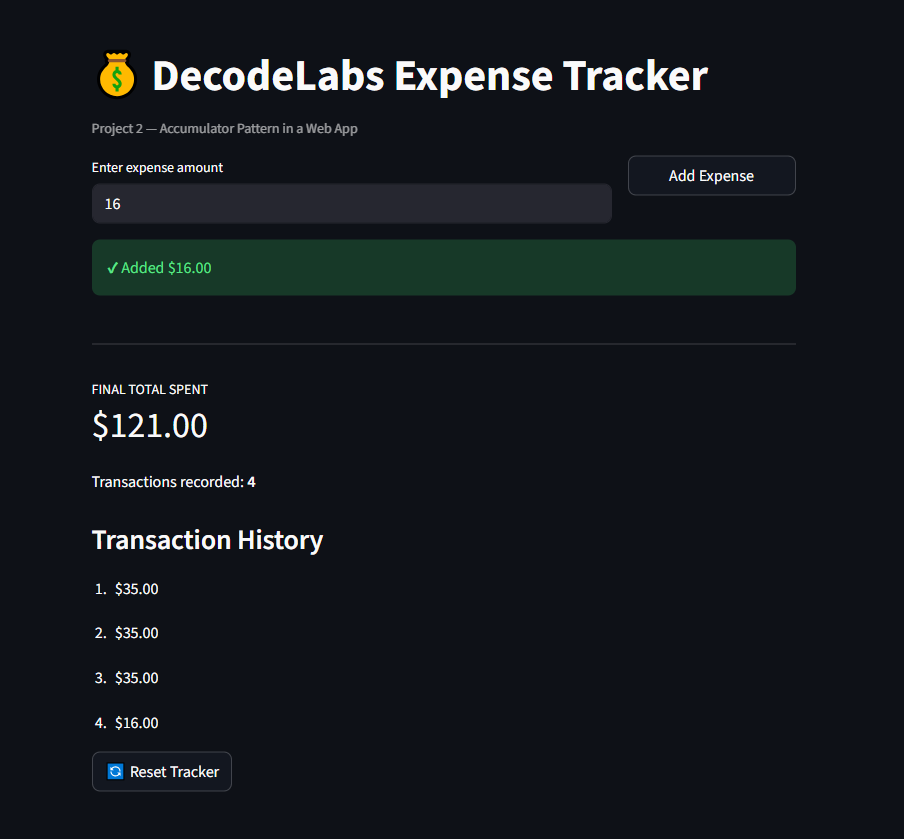

# DecodeLabs Python Programming — Project 2: Expense Tracker

Industrial Training Kit | Batch 2026

A Python script that continuously accepts expense entries from a user, accumulates them into a running total, and displays a final report. This project demonstrates the accumulator pattern, defensive input handling, and state management in backend logic.

Two implementations are included:

- `expense_tracker.py` — terminal-based version
- `expense_tracker_streamlit.py` — web application version built with Streamlit

## Screenshot



## Objective

Create a script where users enter expense amounts (for example, 100, 50, 20). The program sums the values and displays the total amount spent.

Key skill: mathematical operations and accumulators (`total = total + new_expense`).

This pattern is foundational for understanding data processing and calculations in backend systems.

## Features

- Handles an unlimited number of transactions in a single session
- `total` is initialized outside the loop so its value persists across every entry
- Invalid (non-numeric) input is caught using `try/except ValueError` instead of crashing the program
- Negative expense values are rejected
- A sentinel value provides a controlled exit point (`quit` in the terminal version, a Reset button in the Streamlit version)
- Output is decoupled from calculation logic and presented as a formatted summary

## Requirements

- Python 3.8 or later
- Streamlit (required only for the web application version)

## Running the Terminal Version

```bash
python expense_tracker.py
```

Enter expense amounts one at a time. Type `quit` to stop and view the final total.

## Running the Streamlit Version

Install Streamlit (one-time setup):

```bash
pip install streamlit
```

Run the application:

```bash
streamlit run expense_tracker_streamlit.py
```

The app opens automatically in a browser window at `http://localhost:8501`.

## Core Logic: The Accumulator Pattern

```python
total = 0.0  # initialized once, outside the loop

while True:
    expense = float(input("Enter expense: "))
    total += expense  # State(new) = State(old) + Input
```

This pattern reflects how running balances are maintained in real-world systems such as ledgers, banking applications, and financial software — a value that updates with each new transaction while preserving its prior state.

## Project Structure

```
Project2_ExpenseTracker/
├── expense_tracker.py
├── expense_tracker_streamlit.py
├── screenshot.png
└── README.md
```

## Author

Developed as part of the DecodeLabs Python Programming Industrial Training Kit, Batch 2026.

Contact: decodelabs.tech@gmail.com
Website: www.decodelabs.tech
Location: Greater Lucknow, India
